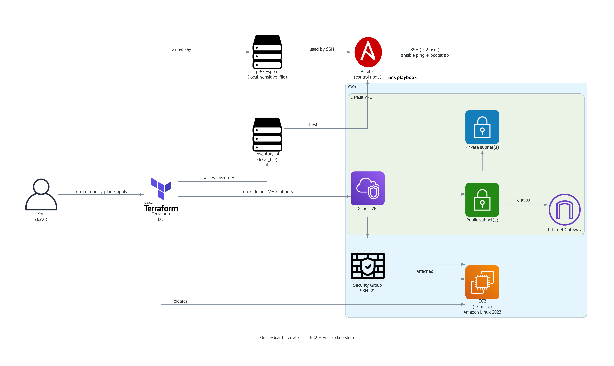

# gg-ansible-ec2 (P9) — Terraform → EC2 (Elastic Compute Cloud) → Ansible (Automation tool) bootstrap

**Goal:** Provision **1× EC2 (Elastic Compute Cloud)** instance with **Terraform (Infrastructure as Code)**, generate **SSH (Secure Shell)** access + **Ansible (Automation tool)** inventory, then run Ansible playbooks to validate connectivity and bootstrap the host.

## 🧠 What this repo demonstrates
• **Terraform (Infrastructure as Code):** creates compute + minimum access wiring  
• **Ansible (Automation tool):** repeatable configuration (ping + bootstrap)  
• **Evidence-first docs:** screenshots prove each milestone

---

## 🏗️ Architecture
**PNG (primary, generated by code):**  
`docs/diagrams/gg-ansible-ec2-arch.png`

**Editable (backup, draw.io (diagrams.net)):**  
`docs/diagrams/gg-ansible-ec2-arch.drawio`

**Diagram source (Python):**  
`docs/diagrams/arch.py`

---

## 📁 Repo structure
• `terraform/` → Terraform (Infrastructure as Code) files  
• `ansible/` → Ansible (Automation tool) config + inventory + playbooks  
• `docs/screenshots/p9/` → proof screenshots  
• `docs/runbook.md` → reproduce steps later (when you rebuild)  
• `docs/evidence.md` → evidence table (claim → proof)

---

## ✅ Proofs (screenshots)
See: `docs/evidence.md`

---

## 📓 Runbook
See: `docs/runbook.md`

---

## 🧹 Cleanup (when you rebuild later)
• `terraform destroy` (Terraform (Infrastructure as Code)) — removes EC2 (Elastic Compute Cloud) resources
